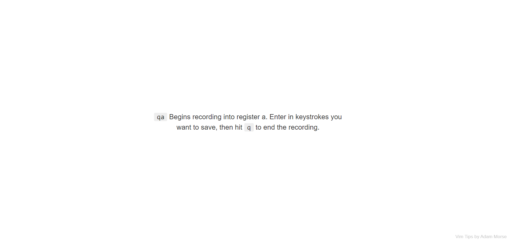

# vimtips PLUS

An enhancement to the vimtips extension (now not updated for 7 years). 

## Upgrades:
- Vim editor in the new tab page: Practice the tip immediately.
- Use the in-page editor as a place to save sticky notes.
- More tips
- Dark mode (including ALT+SHIFT+T shortcut)

Vim tips!
