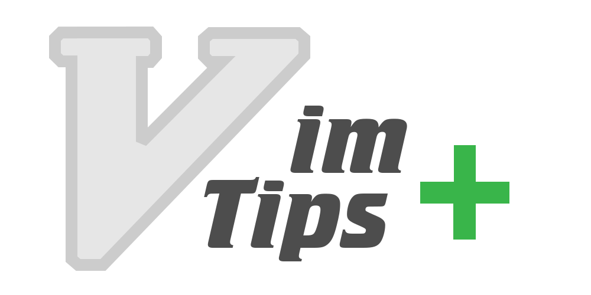
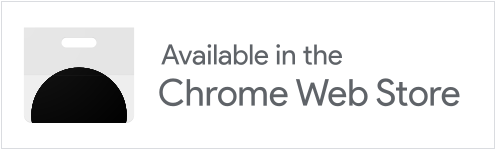
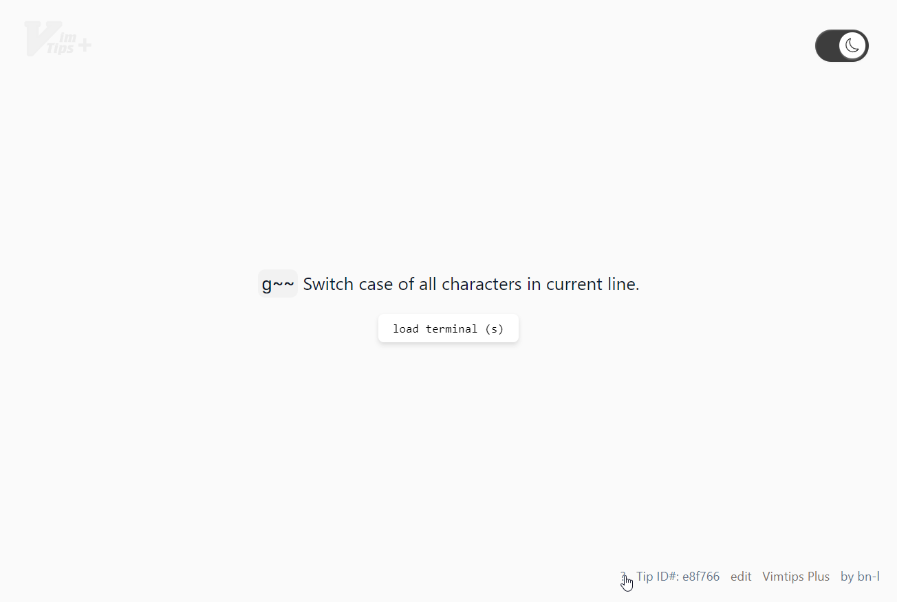

 

A chrome new tab extension / daily site with a built-in wasm implemention of vim.  
Learn vim with daily small tips that you can practice right in the browser.

<a href="https://vimtipsplus.netlify.app/">https://vimtipsplus.netlify.app</a>

<!-- Must have extension available to use badge -->
<!--  -->

 

## Usage:
 - Click outside the terminal to defocus it. When the terminal has focus it will capture all key strokes
- Type `:export` to download the current file
- Drag and drop a file on the terminal to edit it
- `:e tutor` to run the vim tutor

 

## Shortcuts:
(when terminal is unfocussed)

|    Description      |       Shortcut           |
|---------------------|--------------------------|
| Toggle this help    |           ?              |
| Load Vim Terminal   |           s              |
| Random tip          |           +              |
| Next tip            |           ]              |
| Previous tip        |           [              |

